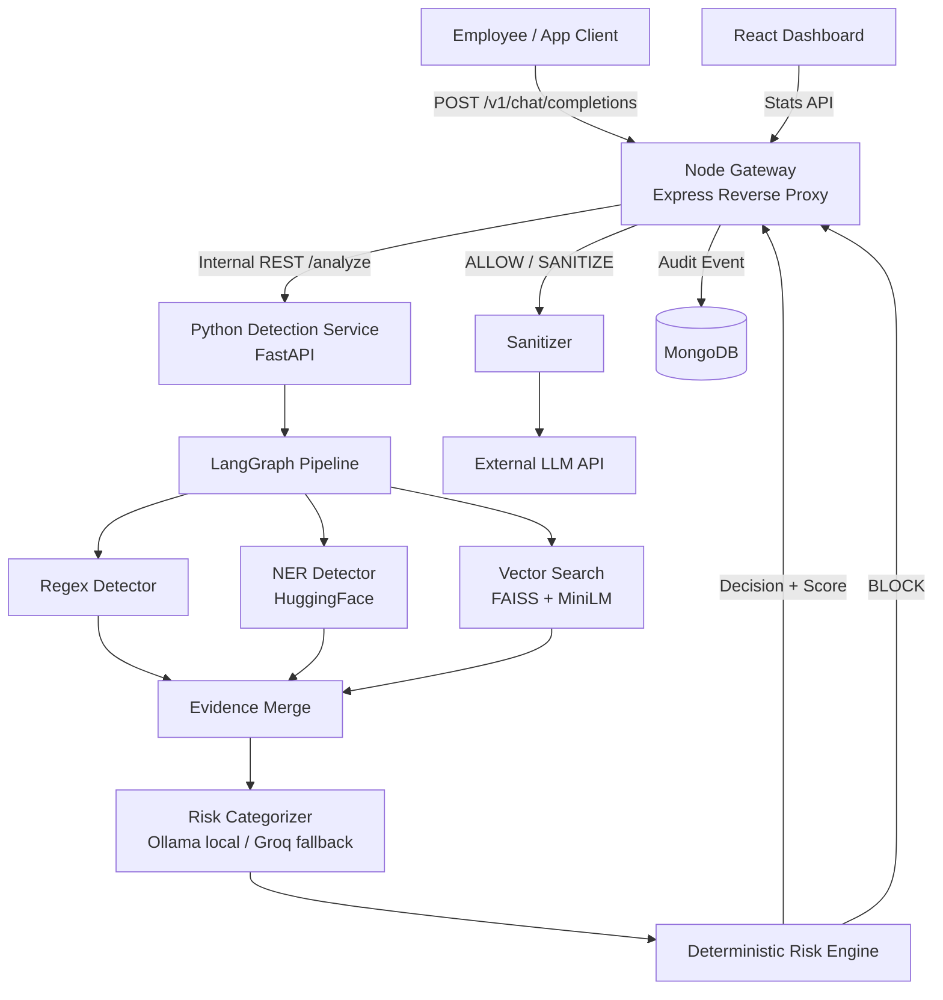
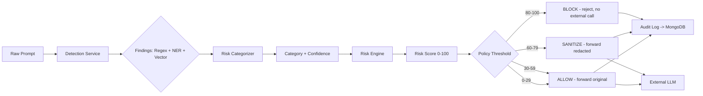
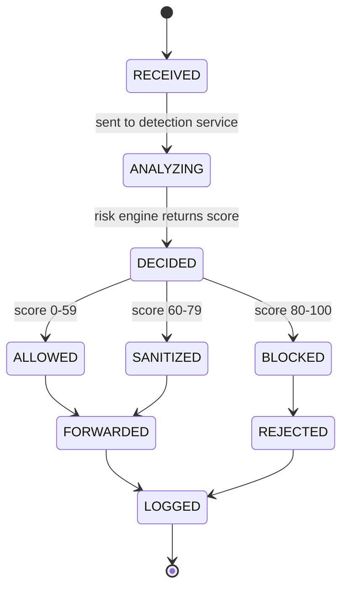

# PROJECT COMPREHENSIVE BLUEPRINT: SentinelAI

| Version | Date | Change |
|---|---|---|
| 1.0 | 2026-08-12 | Initial blueprint — architecture frozen, stack authorized, phases defined |

## 1. Executive Summary & Core Goals

SentinelAI is a reverse-proxy gateway that sits between employees/applications and external LLM providers (OpenAI-compatible APIs). Every prompt is intercepted, analyzed for PII, credentials, and confidential company data, scored by a deterministic risk engine, and then **allowed**, **sanitized**, or **blocked** before it ever reaches an external model. Every decision is audited and surfaced on a live dashboard.

**Problem it solves:** employees pasting secrets, PII, or confidential project details into ChatGPT/Claude/Gemini with zero oversight. SentinelAI adds a policy-enforced checkpoint without requiring employees to change behavior.

**Core architectural principle (non-negotiable):** detectors find evidence → the local/Groq LLM interprets evidence → the deterministic risk engine calculates the score → the policy engine decides the action → the sanitizer transforms the request → the gateway enforces the decision. No LLM in this system is allowed to make the final security decision.

**Project Ownership Context:** Solo — Amritansu is sole builder and sole assignee for every task in Section 5.

## 2. Technical Stack Mapping

| Layer | Tech | Why |
|---|---|---|
| Gateway (client-facing) | Node.js + Express.js | OpenAI-compatible reverse proxy, request/response passthrough |
| Dashboard frontend | React + Vite + TailwindCSS + Recharts | Free, matches approved stack, Recharts fills the charting gap (Matplotlib/Seaborn are Python-only, not usable here) |
| Auth | JWT | Dashboard login |
| Detection pipeline | Python + FastAPI (internal service only, not client-facing) | LangGraph, HuggingFace, FAISS, and Ollama's client are all Python-native and you already know this ecosystem. FastAPI is the one stack addition outside the original matrix — authorized as unavoidable glue between Node and the Python pipeline. |
| Pipeline orchestration | LangGraph (Python) | Linear evidence-gathering chain, not a multi-agent system — authorized, no scope creep |
| Regex detector | Python `re` | PAN, Aadhaar, email, phone, API keys, JWTs, private key headers, DB connection strings |
| NER detector | HuggingFace Transformers, model `dslim/bert-base-NER` | Entity extraction (PERSON/ORG/LOCATION) |
| Vector search | FAISS + `sentence-transformers` (`all-MiniLM-L6-v2`) | In-process, no server, fits 12GB RAM / 2GB VRAM ceiling. Replaces Chroma now that everything is Python-native. |
| Risk categorizer | Ollama (local, `qwen2.5:1.5b-instruct-q4_K_M`) OR Groq (`llama-3.1-8b-instant`) | Pluggable via env var — same interface, one config flip |
| Risk engine + policy engine | Pure Python, deterministic | Final authority — no LLM output is trusted directly |
| Sanitizer | Deterministic regex/NER span replacement | No LLM used for sanitization |
| Database | MongoDB | Audit events, employee aggregation, policy config, company knowledge metadata |
| Local dev | Docker Compose | node-gateway, python-detection, mongodb, ollama |
| Deployment | Render (Node + Python services), Vercel (dashboard), MongoDB Atlas free cluster | $0 budget maintained |

**Environment variables:**
```
GATEWAY_PORT=4000
DETECTION_SERVICE_URL=http://localhost:8000
MONGODB_URI=
JWT_SECRET=

RISK_MODEL_PROVIDER=local          # local | groq
OLLAMA_BASE_URL=http://localhost:11434
OLLAMA_MODEL=qwen2.5:1.5b-instruct-q4_K_M
GROQ_API_KEY=
GROQ_MODEL=llama-3.1-8b-instant

EXTERNAL_LLM_BASE_URL=             # the actual provider being proxied to
EXTERNAL_LLM_API_KEY=

VECTOR_MODEL_NAME=all-MiniLM-L6-v2
NER_MODEL_NAME=dslim/bert-base-NER
FAISS_INDEX_PATH=./data/company_index.faiss

RISK_THRESHOLD_SAFE_MAX=29
RISK_THRESHOLD_LOW_MAX=59
RISK_THRESHOLD_HIGH_MAX=79          # anything above = CRITICAL/BLOCK
```

**Cost flag:** Groq free tier has rate limits but is $0. If prototype traffic exceeds free-tier rate limits, either throttle the fallback or accept degraded local-only mode — no paid tier required for this phase.

## 3. System Architecture & Data Flows

### System Architecture Diagram


### Data Flow Diagram


### Request State Machine


## 4. Database Schema & Data Models

**`requests` (audit events)**
| Field | Type | Notes |
|---|---|---|
| request_id | String (UUID) | Primary key |
| timestamp | ISODate | |
| employee_id | String | FK → employees |
| risk_score | Number (0–100) | |
| risk_level | String enum | SAFE / LOW / HIGH / CRITICAL |
| action | String enum | ALLOW / SANITIZE / BLOCK |
| categories | [String] | e.g. PII_EXPOSURE, CREDENTIAL_EXPOSURE |
| detectors_fired | [String] | regex / ner / vector / local_llm / groq |
| sanitized | Boolean | |
| original_char_count | Number | |
| sanitized_char_count | Number | nullable |

**`employees`**
| Field | Type |
|---|---|
| employee_id | String (PK) |
| name | String |
| department | String |
| total_requests | Number |
| total_violations | Number |
| avg_risk | Number |
| risk_tier | String (Low/Medium/High) |

**`policy_config`** (singleton document, `_id: "active"`)
| Field | Type |
|---|---|
| thresholds | Object `{safe_max, low_max, high_max}` |
| category_weights | Object `{PII_EXPOSURE: 35, CREDENTIAL_EXPOSURE: 60, ...}` |
| version | Number |
| updated_at | ISODate |

**`company_knowledge`** (metadata; vectors live in the FAISS index file, this collection is the re-embeddable source of truth)
| Field | Type |
|---|---|
| doc_id | String (PK) |
| title | String |
| classification | String (CONFIDENTIAL/INTERNAL/PUBLIC) |
| content | String |
| embedded_at | ISODate |

## 5. Granular, Modular Implementation Phases

**Phase 1: Gateway Foundation (Weight: 15%)**
- **Task 1.1: Node/Express scaffold + Docker**
  - Objective: Initialize Express app, Dockerfile, docker-compose.yml with node-gateway, mongodb, ollama services.
  - Assignee: User
  - Boundaries: No detection logic here. No dashboard UI here.
  - Target Output: Running container, `GET /health` returns 200.
- **Task 1.2: OpenAI-compatible intercept endpoint**
  - Objective: `POST /v1/chat/completions` extracts prompt text, generates `request_id` (UUID), does NOT yet call detection service.
  - Assignee: User
  - Boundaries: Do not forward to external LLM yet.
  - Target Output: Endpoint returns `{request_id, prompt_received: true}`.
- **Task 1.3: MongoDB models**
  - Objective: Implement `requests`, `employees`, `policy_config`, `company_knowledge` schemas (Mongoose or native driver).
  - Assignee: User
  - Boundaries: No write logic wired to the request flow yet — schema only, with a seed script for `policy_config` defaults.
  - Target Output: Models file + seed script that inserts default thresholds/weights.

**Phase 2: Python Detection Service Skeleton (Weight: 15%)**
- **Task 2.1: FastAPI scaffold + contract**
  - Objective: `POST /analyze` accepting `{request_id, prompt}`, returning a fixed response shape `{risk_score, risk_level, action, categories, detectors_fired}` — return hardcoded dummy values for now.
  - Assignee: User
  - Boundaries: No real detector logic yet.
  - Target Output: Running FastAPI container, `/docs` (Swagger) accessible.
- **Task 2.2: Node → Python wiring**
  - Objective: Gateway's `/v1/chat/completions` calls `DETECTION_SERVICE_URL/analyze`, awaits response, logs it (console only for now).
  - Assignee: User
  - Boundaries: No decision enforcement yet — just wiring and logging.
  - Target Output: End-to-end request produces a logged dummy risk response.
- **Task 2.3: LangGraph pipeline skeleton**
  - Objective: Define LangGraph nodes (regex, ner, vector, merge, categorizer, engine) as no-op passthroughs, wired in the correct topology (three parallel → merge → categorizer → engine).
  - Assignee: User
  - Boundaries: Nodes return stub data only.
  - Target Output: Graph compiles and runs end-to-end with stub outputs.

**Phase 3: Detectors (Weight: 20%)**
- **Task 3.1: Regex detector**
  - Objective: Implement pattern set (PAN, Aadhaar, email, phone, API keys, JWTs, private key headers, DB conn strings). Return `[{type, value_span, severity, confidence}]`. Never log the raw matched value — log span + type only.
  - Assignee: User
  - Boundaries: No NER or vector logic here.
  - Target Output: Unit-testable `detect_regex(text) -> List[Finding]`.
- **Task 3.2: NER detector**
  - Objective: Load `dslim/bert-base-NER` via HuggingFace pipeline, extract PERSON/ORG/LOCATION entities.
  - Assignee: User
  - Boundaries: No interpretation of whether an entity is "dangerous" — extraction only.
  - Target Output: `detect_entities(text) -> List[Entity]`.
- **Task 3.3: Vector search (company knowledge)**
  - Objective: Build a synthetic company knowledge base (5–10 fake confidential project docs), embed with `all-MiniLM-L6-v2`, build FAISS index, implement top-k query function.
  - Assignee: User
  - Boundaries: No risk scoring here — retrieval only.
  - Target Output: `search_company_context(text, k=3) -> List[Match]`, persisted FAISS index file.

**Phase 4: Risk Categorizer & Deterministic Engine (Weight: 20%)**
- **Task 4.1: Local LLM categorizer (Ollama)**
  - Objective: System prompt defining fixed categories (PII_EXPOSURE, CREDENTIAL_EXPOSURE, FINANCIAL_DATA, CONFIDENTIAL_COMPANY_DATA, INTERNAL_SYSTEM_INFORMATION, SOURCE_CODE_SENSITIVE, SECURITY_SENSITIVE_INFORMATION, SAFE, UNKNOWN). Feed merged evidence (regex + NER + vector matches), parse structured JSON output `{categories: [{category, confidence, evidence}]}`.
  - Assignee: User
  - Boundaries: Model never outputs ALLOW/BLOCK — categories + confidence only.
  - Target Output: `classify_local(evidence) -> CategoryResult`.
- **Task 4.2: Groq categorizer (fallback)**
  - Objective: Same interface as 4.1, calling Groq API with `llama-3.1-8b-instant`.
  - Assignee: User
  - Boundaries: Must be a drop-in swap — same function signature as `classify_local`.
  - Target Output: `classify_groq(evidence) -> CategoryResult`; provider selected via `RISK_MODEL_PROVIDER`.
- **Task 4.3: Deterministic risk engine**
  - Objective: Normalize categories across detectors (avoid double-counting e.g. regex + LLM both flagging CREDENTIAL_EXPOSURE), apply category weights from `policy_config`, sum to a 0–100 score, map to risk level and action via thresholds.
  - Assignee: User
  - Boundaries: This is the ONLY place a final action decision is made. No LLM call inside this function.
  - Target Output: `calculate_risk(category_results) -> {score, level, action}`.

**Phase 5: Sanitizer & Enforcement (Weight: 10%)**
- **Task 5.1: Sanitizer**
  - Objective: Deterministic replacement of regex/NER spans with placeholder tokens (`[PAN_CARD]`, `[PERSON_NAME]`, `[CONFIDENTIAL_PROJECT]`, etc.) — no LLM used.
  - Assignee: User
  - Boundaries: Sanitizer runs only after the decision is made, and only operates on spans already identified by detectors.
  - Target Output: `sanitize(text, findings) -> sanitized_text`.
- **Task 5.2: Gateway decision enforcement**
  - Objective: Gateway acts on `/analyze` response — ALLOW forwards original prompt to `EXTERNAL_LLM_BASE_URL`, SANITIZE forwards sanitized text, BLOCK returns a rejection payload (risk score + categories + reason) and never calls the external LLM.
  - Assignee: User
  - Boundaries: Gateway must not override the engine's decision.
  - Target Output: All three paths (ALLOW/SANITIZE/BLOCK) functioning end-to-end.
- **Task 5.3: Audit logging**
  - Objective: Write full audit event (per Section 4 schema) to MongoDB for every request, regardless of action.
  - Assignee: User
  - Boundaries: Never store the raw sensitive value — spans/types/scores only.
  - Target Output: Every request produces exactly one `requests` document.

**Phase 6: Dashboard (Weight: 15%)**
- **Task 6.1: React scaffold + auth**
  - Objective: Vite + React + Tailwind app, JWT login against a hardcoded/seeded admin user.
  - Assignee: User
  - Boundaries: No live data yet.
  - Target Output: Login flow working, protected route shell.
- **Task 6.2: Stats aggregation API (Node)**
  - Objective: Endpoints for today's totals (allowed/sanitized/blocked/avg risk), top violation categories, per-employee risk table.
  - Assignee: User
  - Boundaries: Aggregation only — no new detection logic.
  - Target Output: `GET /stats/summary`, `GET /stats/employees`.
- **Task 6.3: Dashboard UI**
  - Objective: Recharts visualizations (requests over time, action breakdown, top violations bar chart) + employee risk table.
  - Assignee: User
  - Boundaries: Read-only dashboard — no policy editing UI in V1.
  - Target Output: Functional dashboard consuming 6.2's endpoints.

**Phase 7: Deployment & Testing (Weight: 5%)**
- **Task 7.1: Docker Compose full stack**
  - Objective: Single `docker-compose up` running node-gateway, python-detection, mongodb, ollama together.
  - Assignee: User
  - Target Output: Full local stack reachable, gateway forwarding real requests end-to-end.
- **Task 7.2: Free-tier deployment**
  - Objective: Render (Node + Python services), Vercel (dashboard), MongoDB Atlas free cluster.
  - Assignee: User
  - Target Output: Publicly reachable URLs for gateway and dashboard.
- **Task 7.3: End-to-end test suite**
  - Objective: Postman collection or script covering: safe prompt (ALLOW), PII-containing prompt (SANITIZE), credential+confidential prompt (BLOCK).
  - Assignee: User
  - Target Output: Test collection checked into repo, all three paths passing.

## 6. Verification & Unified Testing Suite

| Task | PASS condition | Verify via |
|---|---|---|
| 1.2 | Returns request_id for any prompt | curl POST |
| 2.1/2.2 | Dummy risk response logged for real request | curl + console log |
| 3.1 | Known PAN/email/API-key strings all detected, spans correct | Unit test with fixture strings |
| 3.2 | Known PERSON/ORG entities extracted from test sentences | Unit test |
| 3.3 | Query about a seeded confidential project returns that doc in top-3 | Unit test |
| 4.1/4.2 | Same evidence input produces same category shape from both providers | Contract test, swap env var and re-run |
| 4.3 | Known evidence combos map to expected score ranges (no double-counting) | Unit test with fixed inputs |
| 5.1 | Sanitized output contains no raw PII/credential values | String assertion |
| 5.2 | BLOCK path never triggers external LLM call (mock and assert not called) | Integration test |
| 5.3 | One `requests` document per call, no raw secrets in it | MongoDB query after test run |
| 6.2/6.3 | Dashboard numbers match manual count of test requests | Manual cross-check |
| 7.3 | All 3 scenarios (ALLOW/SANITIZE/BLOCK) pass via Postman | Postman collection run |

Local verification loop for every phase: `docker-compose up` → curl or Postman against the gateway → check MongoDB directly (`mongosh`) → check dashboard reflects it.
